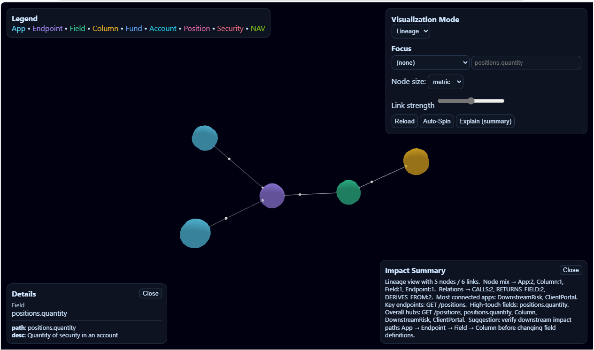

# FNV GraphRAG Visualization

Interactive 3D visualization of Fund Accounting data lineage and API usage, powered by **FastAPI + Neo4j + 3D-Force-Graph (Three.js)**.

## Features
- 3 Visualization Modes:
  - **Lineage** – data field and endpoint relationships  
  - **Usage** – API calls and consumer insights  
  - **Domain** – fund → account → position → security graph  
- **Focus filters** (fund / endpoint / app / field / column)
- **Details panel** with node properties
- **Impact summary** (AI-style text)
- Fully Docker/Neo4j compatible



## Run locally

```bash
python -m venv .venv
. .venv/Scripts/activate
pip install -r requirements.txt

# Run Neo4j (example)
docker run -d --name neo4j -p 7474:7474 -p 7687:7687 `
  -e NEO4J_AUTH=neo4j/test1234 -v ./neo4j/data:/data neo4j:5

# Start FastAPI
uvicorn app:app --reload --port 8080


